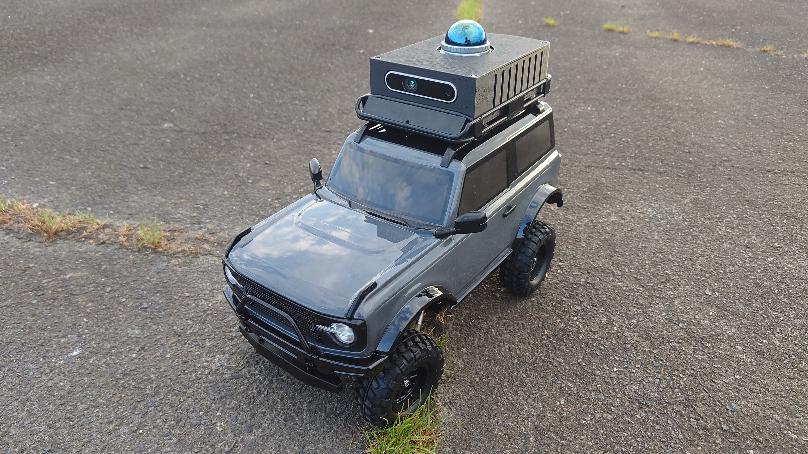
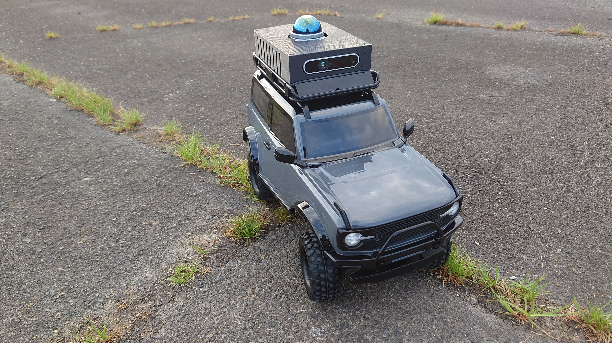
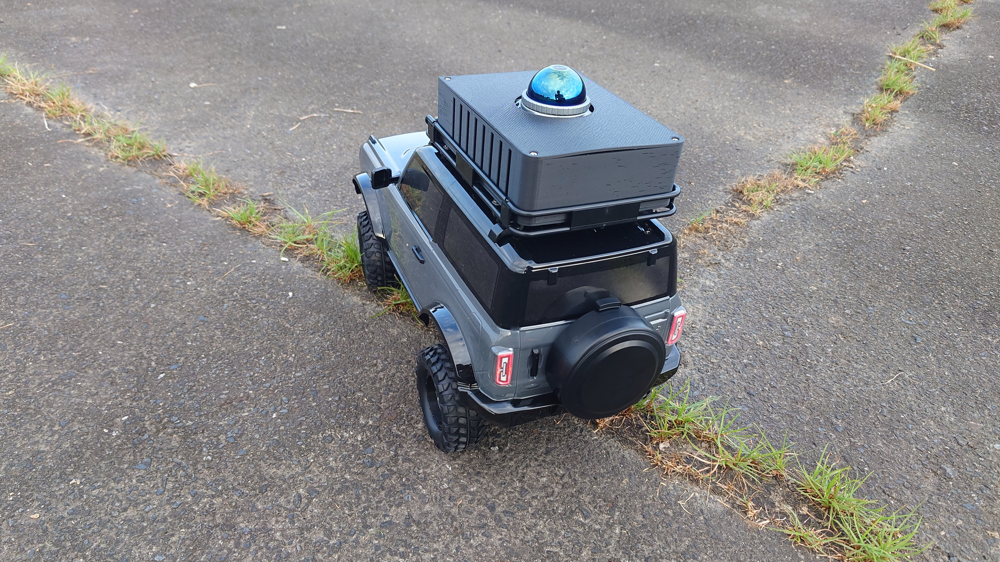
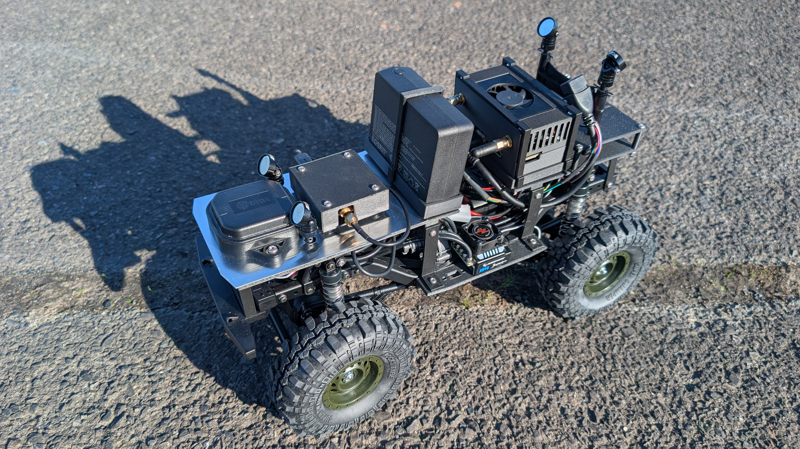
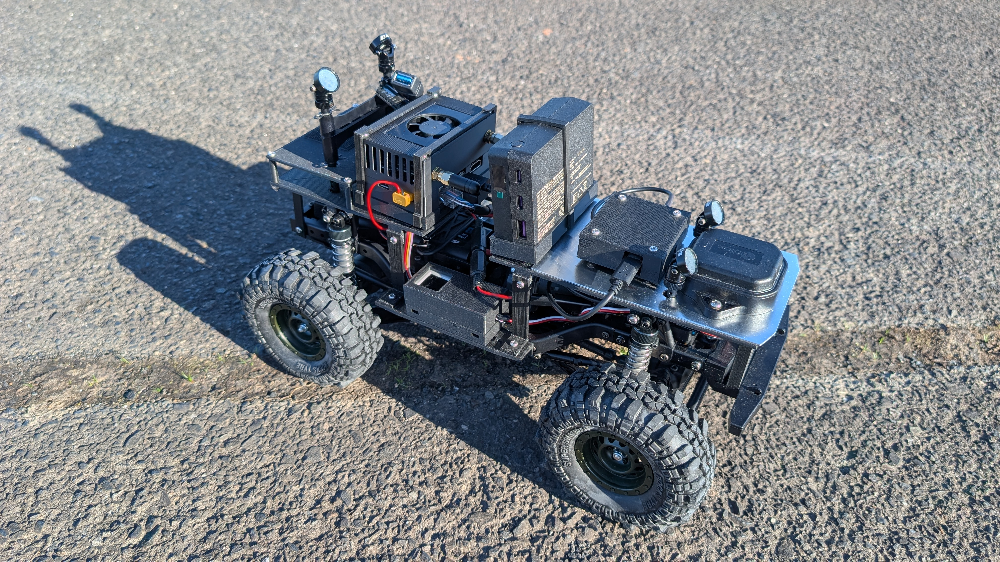
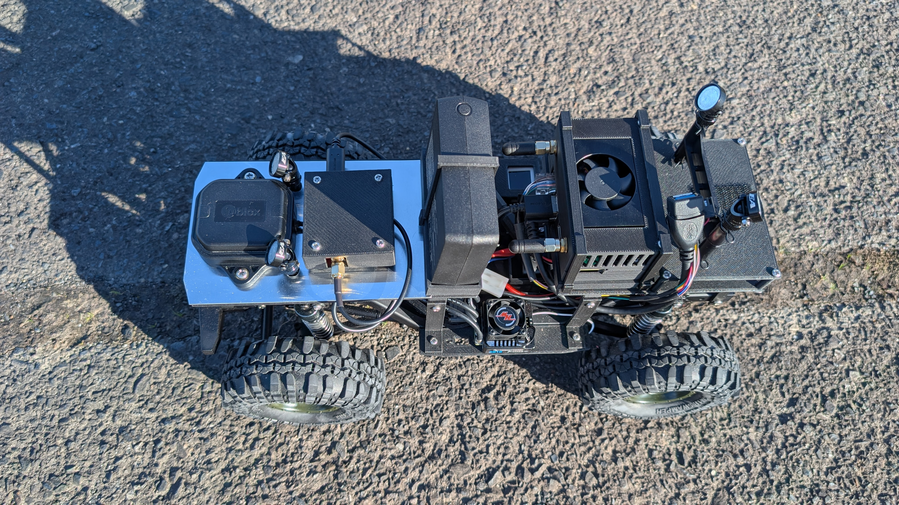
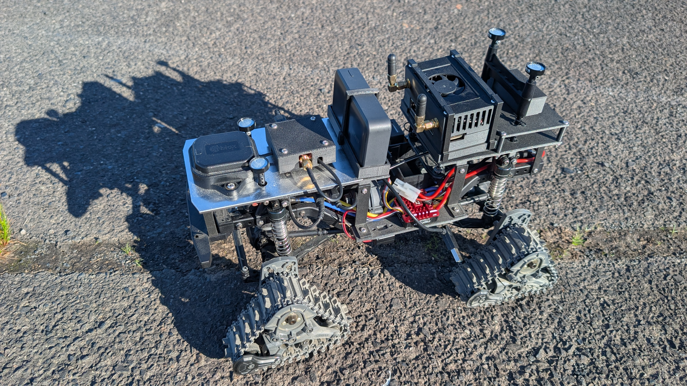
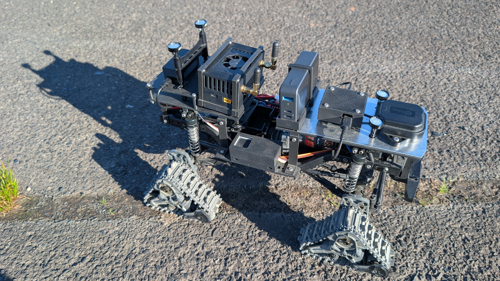
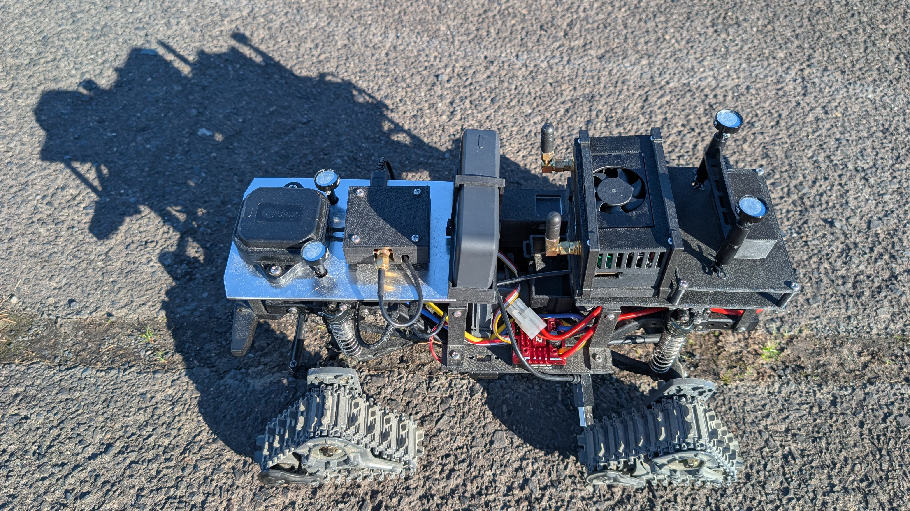

# auto-rccar-toy

## はじめに

本ソフトはRCカーを自律走行させるソフトである  
ローカライゼーションはRTK-GNSSとLiDARとIMUを使用  
ナビゲーションはNav2を使用している  
方向検出や障害物検出にCameraのIMUやDepthも使用している  

<table>
<tr>
<td></td>
<td></td>
<td></td>
</tr>
<tr>
<td></td>
<td></td>
<td></td>
</tr>
<tr>
<td></td>
<td></td>
<td></td>
</tr>
</table>

## 動作環境

- ハードウェア

  - RCカー
    - 1/10RC フォード ブロンコ 2021 (CC-02シャーシ)
    - ホイール仕様
      - Goolsky AUSTAR 110mm 1.9インチ リム ラバー タイヤ ホイール
      - HOBBYWING COMBO-XR10 Justock G3S ESC & 3650 SD G2.1 ブラシレスモーター 25.5T
      - HOOYIJ DS3245SG 45kg サーボ 270°
      - M5 AtomS3R
    - トラックユニット仕様
      - OP.1948 トラックユニット コンバージョン
      - HOBBYWING QuicRUN 540 ブラシモーター 30T
      - HOBBYWING QuicRUN-WP-1080-G2-Brushed
      - FLASH HOBBY M35CHW 35KG サーボ 180°
      - M5 ATOM Matrix
    - バッテリー(G-FORCE BULLET LiPo 7.4V 3000mAh)
  - Jetson
    - Jetson Orin NX
    - Seeed Studio A603 Carrier Board for Jetson Orin NX/Orin Nano
    - Jetson Orin NX モジュール用 ファン付きアルミヒートシンク
    - WiFi(Intel Dual Band Wireless-AC 8265 8265NGW)
    - WiFi アンテナ(BOOBRIE ワイヤレスモジュール小型WIFIアンテナ)
    - SSD(トランセンドジャパン トランセンド 1TB PCIe SSD M.2(2242) NVMe PCIe Gen3×4 M Key TS1TMTE400S)
  - センサ
    - Realsense D435if
    - Ublox F9P
    - Ublox 2周波対応 アンテナ(ANN-MB-00)
    - Livox Mid-360
  - 電源(Jetsonとセンサ用)
    - バッテリー(CIO SMARTCOBY TRIO 67W 20000mAh)  
    or
    - バッテリー(Anker Power Bank 10000mAh 30W)  
  - その他
    - その他配線や部品

- ソフトウェア

  - ROS2 Humble
  - micro-ROS
  - RTKLIB

  - [m5stack-rccar-toy](https://github.com/endusers/m5stack-rccar-toy)

  - Package

    必要となるパッケージは [Dockerfile](https://github.com/endusers/ros-humble-utility/blob/main/docker/Dockerfile) を参照してください  

## 構成図

T.B.A

## セットアップ手順

1. リポジトリをクローンする

    ```bash
    git clone https://github.com/endusers/auto-rccar-toy.git
    ```

1. セットアップスクリプトを実行する

    ```bash
    ./auto-rccar-toy/scripts/setup.sh -w ワークスペースディレクトリ -r
    ```

    ※ 作成するワークスペースのパスを -w で指定してください  
    ※ RTKLIBのインストールが不要の場合は -r の指定を削除してください  
    ※ RTKLIBのインストール先は ~/RTKLIB 固定です  

1. ビルドする

    ```bash
    cd ワークスペースディレクトリ
    colcon build --symlink-install
    ```

1. RTKLIBの設定をする(RTKLIBをインストールした場合)

    本設定は実機環境でRTKLIBを使って動かす場合に必要です  
    シミュレーション環境で動かす場合は本設定は不要です  

    1. 任意のテキストエディタで下記スクリプトを開く

        ```bash
        nano ワークスペースディレクトリ/rtklib-str2str.sh
        ```

    1. ntripの必要箇所を設定する

        ```sh
        ./str2str -in ntrip://[user[:passwd]@]addr[:port][/mntpnt] -out serial://ttyACM0:460800 -b 1
        ```

## シミュレーション環境

1. シミュレーション環境を立ち上げる

    ```bash
    ros2 launch rccar_bringup rccar-simulation.launch.py world:=smalltown.world
    ```

    ※初回起動はエラーになるため、Gazeboが立ち上がった後に、再度立ち上げなおしてください  
    ※ワールドの変更は launchのパラメータに world:={WORLD FILE NAME} にて指定

1. ローカライゼーションを立ち上げる

    ```bash
    ros2 launch rccar_bringup rccar-localization.launch.py use_sim_time:=true
    ```

1. ナビゲーションを立ち上げる

    ```bash
    MAP_DIR=$(ros2 pkg prefix rccar_navigation2)/share/rccar_navigation2/map
    ros2 launch rccar_bringup rccar-navigation.launch.py use_sim_time:=true map:=$MAP_DIR/smalltown/smalltown_world.yaml
    ```

    ※マップの変更は launchのパラメータに map:={YAML FILE PATH} にて指定

1. Rviz2を立ち上げる

    ```bash
    ros2 launch rccar_bringup rccar-rviz.launch.xml use_sim_time:=true
    ```

1. 経路を設定して自律走行を開始する

    [経路設定](#経路設定) 参照

※ワークスペースディレクトリへのパスの指定は省略しています  
※ターミナル起動毎に設定、または、 .bashrc に追加して対応してください  

## 実機環境

1. RCカーの電源をONする

1. JetsonにSSHで接続しRTKLIBを立ち上げる

    ```bash
    cd ワークスペースディレクトリ
    ./rtklib-str2str.sh
    ```

1. JetsonにSSHで接続しロボットを立ち上げる

    ```bash
    ros2 launch rccar_bringup rccar-robot.launch.py
    ```

1. JetsonにSSHで接続しローカライゼーションを立ち上げる

    ```bash
    ros2 launch rccar_bringup rccar-localization.launch.py
    ```

1. JetsonにSSHで接続しナビゲーションを立ち上げる

    ```bash
    ros2 launch rccar_bringup rccar-navigation.launch.py
    ```

1. ホストPCでRviz2を立ち上げる

    ```bash
    ros2 launch rccar_bringup rccar-rviz.launch.xml
    ```

1. 経路を設定して自律走行を開始する

    [経路設定](#経路設定) 参照

※ワークスペースディレクトリへのパスの指定は省略しています  
※ターミナル起動毎に設定、または、 .bashrc に追加して対応してください  

## 経路設定

1. 自立走行させる経路を[Googole My Maps](https://www.google.com/maps/d)で設定する

    経路は順番に設定したいポイントを「マーカーを追加」にて設定する

2. 設定した経路をCSVでエクスポートする

    「レイヤオプション」-「データを書き出す」-「CSV」からエクスポートする

3. ルート配信アプリを立ち上げる

    ```bash
    ros2 launch route_publisher route-publisher.launch.xml
    ```

4. ルート配信アプリに経路を読み込む

    「FileSelect」ボタンを押してGoogle My MapsでエクスポートしたCSVファイルを選択する

5. ルート配信アプリで自律走行を開始する

    「NaviStart」ボタンを押して自律走行を開始する

※サンプルのCSVファイルは「route_publisher」-「route」-「toki-route-001.csv」にあります  
※サンプルのCSVファイルを使用するときは「empty.world」「empty_100m.yaml」を使用してください  
※CSVファイルは、WKT(Well-known text)のPOINTのフォーマットを読み込みます  

## 参考

- Docker環境について

    本ソフトを動かすためのROSのDocker環境を下記ディレクトリにサブモジュールとして登録済み  
    詳細は下記リポジトリを参照してください  

    [auto-rccar-toy/env/ros-humble-utility](https://github.com/endusers/ros-humble-utility)  

    物理PCにセットアップしたい場合で必要となるパッケージは [Dockerfile](https://github.com/endusers/ros-humble-utility/blob/main/docker/Dockerfile) を参照してください  
